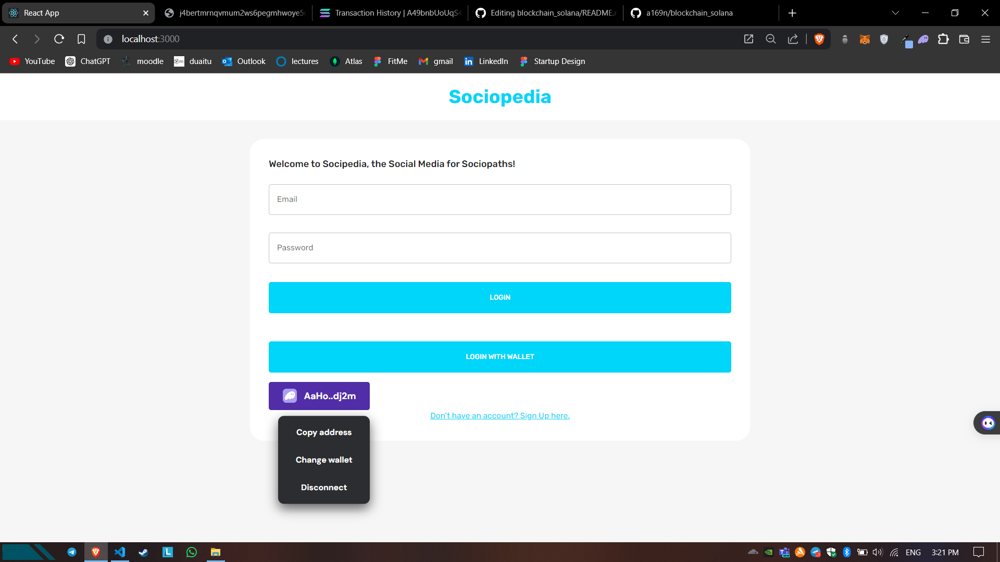

# LinkedOut

### SE-2206. Aibyn Talgatov, Samat Belentbay, Gani Uapov, Kayirkhan Kairolla

## Project Description

The Web3Linkedin project aims to develop a decentralized professional networking platform using the Solana blockchain. The platform enables users to create profiles, connect with other professionals, and showcase their skills and experiences. The primary focus is on creating a web3 LinkedIn-like application where users have control over their data, and interactions are facilitated through smart contracts.

## Features

- User login and sign up : Email/Password or Web3 Wallet
- Profile creation with basic information (name, bio, profile picture, etc.)
- Ability to connect with other users on the platform (Add as a friend)
- Mechanism for creating NFT by certain condition

## Pages

- Connect wallet
- Registration page
- Main page
- User profile page
  - Avatar
  - Address
  - Number of friends
  - Add to Friend/Connect button should show when other person visits this user profile
  - Add to Friend/Connect requests

## Screenshots

### Registration/Login

### Main Page

### User Profile Page Example

## NFT 

## User Actions

- Send friend requests
- Receive friend requests
- Write posts (if user has TOPWEB3 NFT)
- View posts of other users

## License

